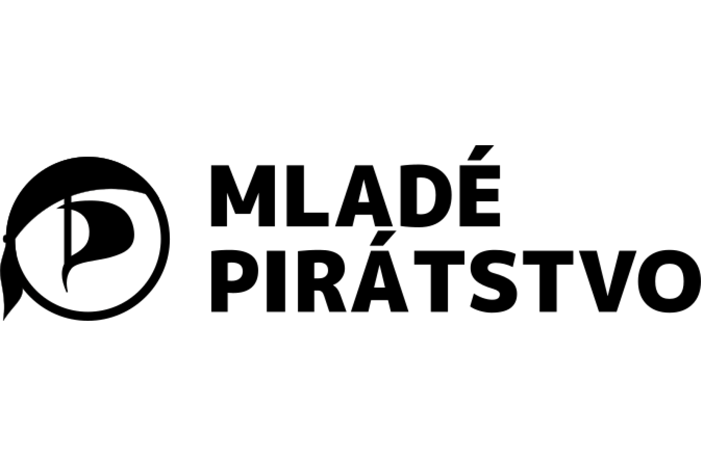
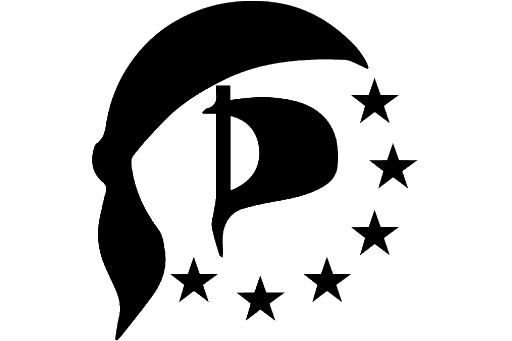
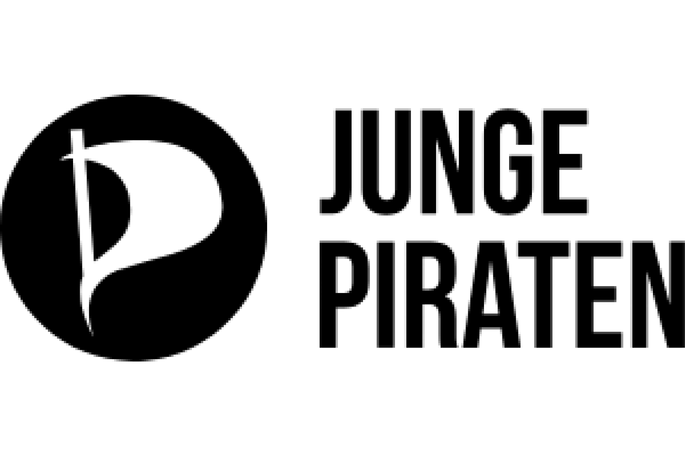
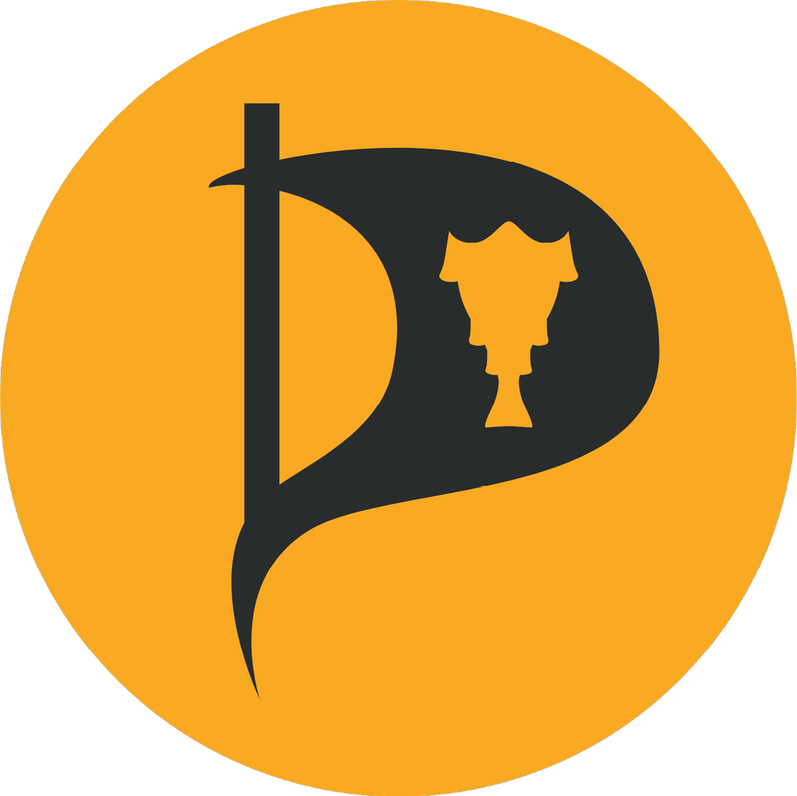
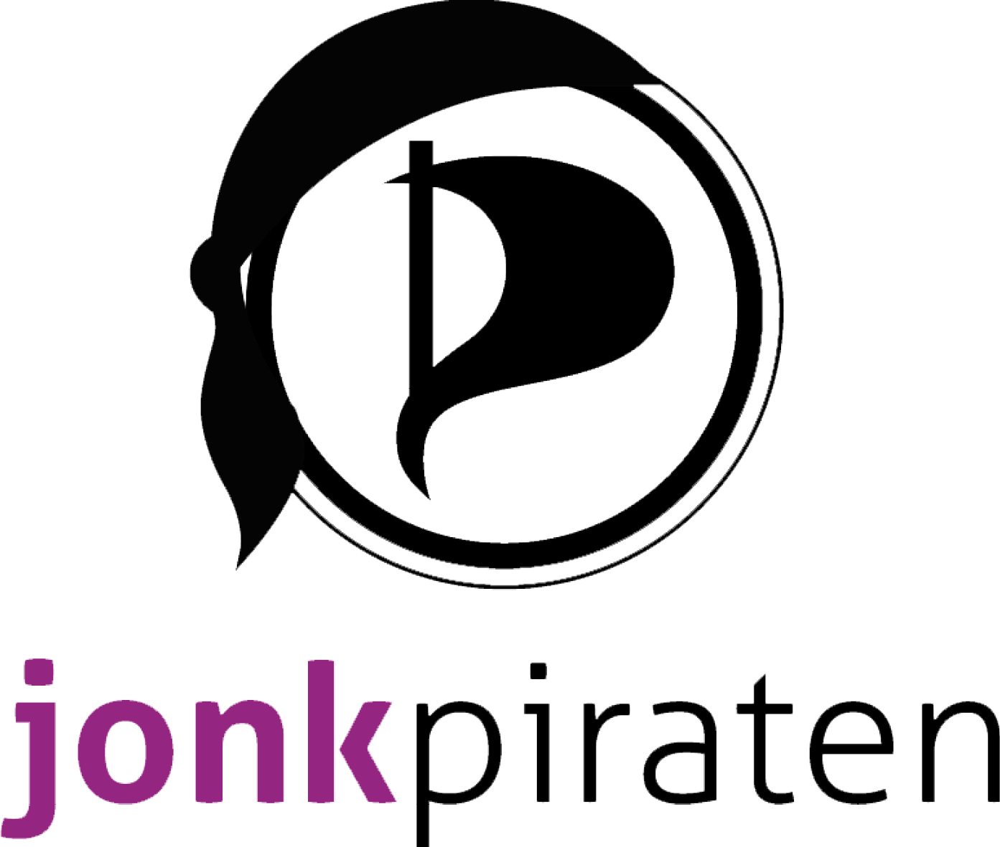
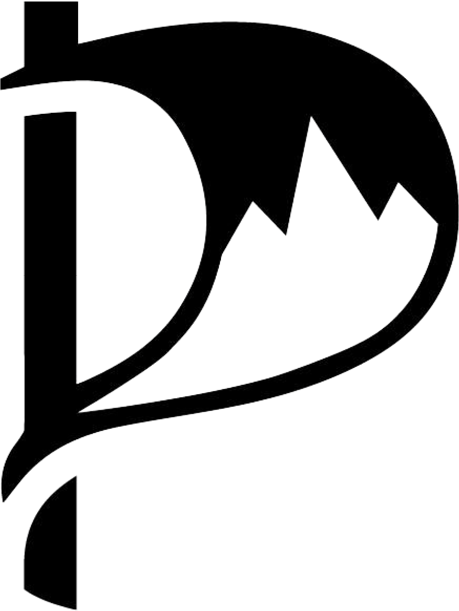

YPE has member organisations all over Europe. Below you can find our member organisation in your country. If you are a member of a Young Pirate organisation that is not in the list below, please contact our office. If you are a young pirate activist and you're looking for an organisation near you, please use the contact information below to join your local Young Pirates.

  

    
    
Mlade Pirátstvo

    
Czech Republic

  

  

    
    
Juenes Pirates

    
France

  

  

    
    
Junge Piraten

    
Germany

  

  

    
    
Ungir Píratar

    
Iceland

  

  

    
    
Jonk Piraten

    
Luxembourg

  

  

    
    
Mladi Pirati

    
Slovenia

  

  

    
    
Ung Pirat

    
Sweden

  

  

    
    
Piraattinuoret

    
Finland

  

